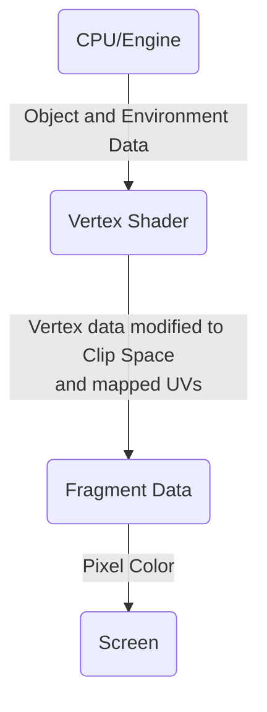

Shaders need external data such as vertex positions, UV coordinates, textures and environment variables (lighting data) to work. The data flows in the graphic pipeline is depicted below



This data needs to be packaged into `structs` so that it can be sent from one shader stage to the other.

>[!info] Syntax of struct definition in HLSL 
>A struct is defined as follows: 
>```hlsl
>struct structName
>{
>	type varName : SEMANTIC
>}
>```
>A semantic is a string attached to a shader input or output that conveys information about the intended use of a parameter. Semantics are required on all variables passed between shader stages. [[Semantics|Learn more about Semantics here]]

A new shader comes with 2 `structs` predefined, 

```hlsl
struct appdata
{
	float4 vertex : POSITION;
	float2 uv : TEXCOORD0;
};

struct v2f
{
	float2 uv : TEXCOORD0;
	float4 vertex : SV_POSITION;
};
```

_For reference, `appData` means data from Engine/CPU; `v2f` means vertex to fragment data_

For Cg/HLSL vertex stages, the vertex data must be passed in as a structure. The snippet above defines a struct `appdata` that will be used to package the data required for the vertex shader of that Shader Object

It is comprised of
- `float4 vertex` variable with a `POSITION` Semantic: When the vertex stage gets an object of this struct, the `vertex` variable holds the current vertex's position
- `float2 uv` variable with a `TEXCOORD0` Semantic: When the vertex stage gets an object of this struct, the `vertex` variable holds the texture coordinates

>[!note] Struct Customization 
>**We can always add more (relevant) variables into the vertex and fragment input structs if needed**
> >[!Danger]- Take what you need
> >Although taking in unnecessary data will slow down the shader, try to limit what you take from the CPU/Engine
> >Taking position, normal, tangent and multiple texture coordinates for an image effect shader is unnecessary, and will slow down the shader

>[!abstract]- Miscellaneous vertex structures
>Several commonly used vertex structures are defined in `UnityCG.cginc` include file, and in most cases it’s enough just to use them. The structures are:
>
>- `appdata_base`: struct consists of position, normal and one texture coordinate.
>- `appdata_tan`: struct consists of position, tangent, normal and one texture coordinate.
>- `appdata_full`: struct consists of position, tangent, normal, four texture coordinates and color.
>-  `appdata_img`: struct consists of position and one texture coordinate.


