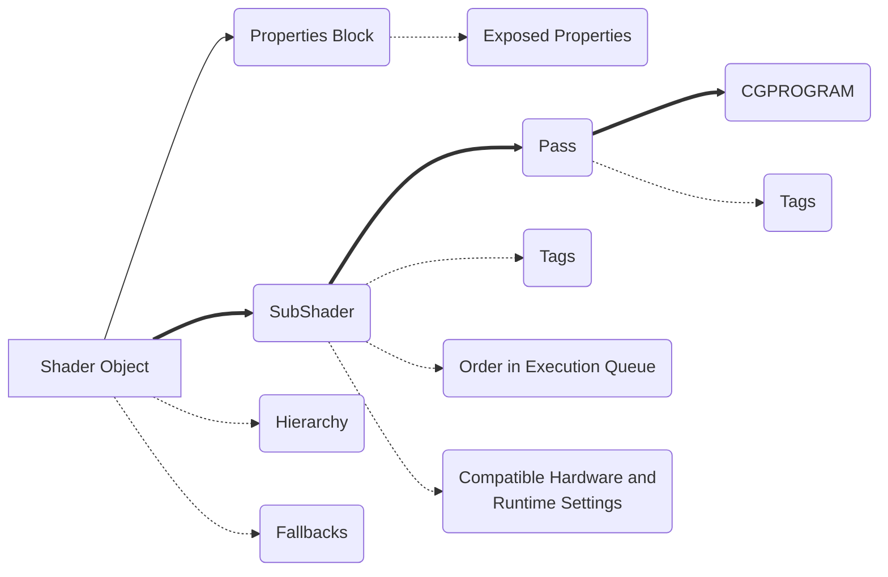

This section contains information on the fundamentals of working with shaders in Unity.

In Unity, when you work with shaders that are part of the graphics pipeline, you usually work with instances of the Shader class. An instance of the `Shader` class is called a Shader object.

A Shader object is a Unity-specific way of working with shader programs; it is a wrapper for shader programs and other information. It lets you define multiple shader programs in the same file, and tell Unity how to use them.

## Inside a Shader object

A Shader object has a nested structure. It organizes information into structures called [[SubShader|SubShaders]] and [[Pass|Passes]]. It organizes shader programs into **shader variants**.

## Shader Object

Contains the Properties block and the SubShaders block. Also defines the name of the shader in the shader inspector and it's position in that hierarchy and provides shader fallbacks if Unity cannot run the given shader

## SubShader Block

Contains one or more SubShaders, defines execution orders and Tags for those subshaders
[[SubShader|Read more here]]

## Passes Block
Contains one or more passes. Each pass contains a CG/HLSL snippet that has the actual shader code. Can also be modified via Tags

[[Pass|Read more here]]

Next up: [[Structure of a Shader File in Unity|Structure of shaders in detail]]
